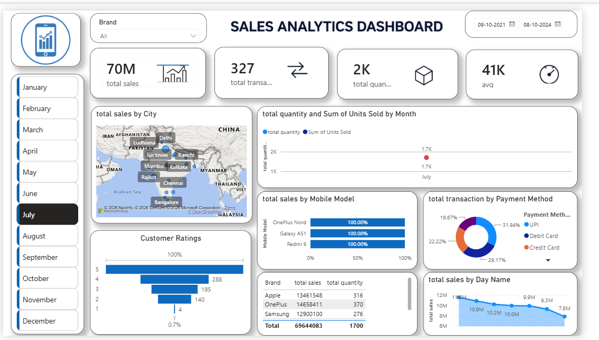

# Sales Analytics Dashboard

## Overview
This project is an interactive Power BI Sales Analytics Dashboard built using Power BI, DAX, and Power Query.

## Dashboard Preview

## Dashboard Features
- Total Sales
- Total Transactions
- Total Quantity Sold
- Average Sales
- Sales by City
- Monthly Sales Trend
- Sales by Mobile Model
- Payment Method Analysis
- Customer Ratings
- Sales by Day Name

## Tools Used
- Power BI
- DAX
- Power Query
- Microsoft Excel

## Key Insights
- Apple generated the highest sales.
- UPI is the most preferred payment method.
- Interactive filters allow analysis by Brand, Date, and Month.
